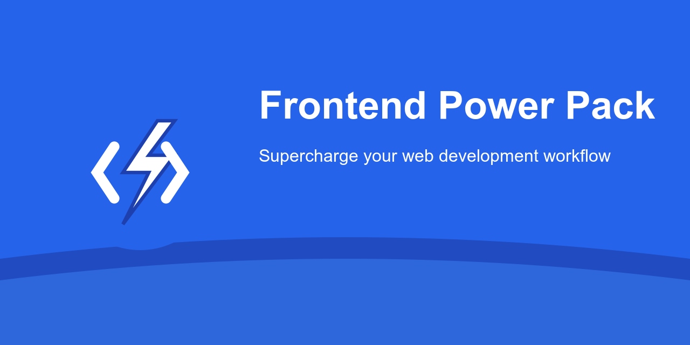

# Frontend Power Pack ⚡

> The ultimate VS Code toolset for modern web development. Boost your productivity with 15+ premium extensions trusted by professional developers worldwide.

## Why Choose Frontend Power Pack? 🚀

- **All-in-One Solution**: Everything you need for modern web development
- **Time-Saving**: Set up your entire workflow in seconds
- **Performance Focused**: Carefully selected for optimal VS Code performance
- **Industry Standard**: Used by companies worldwide
- **Always Updated**: Maintained with latest web development trends

## Included Power Tools 🛠️

### Smart Coding
- **Auto Close/Rename Tag**: Intelligent HTML editing
- **Path Intellisense**: Smart path completion
- **Snippets**: 45+ ready-to-use code templates

### Styling & Design
- **CSS Peek**: Instant CSS navigation
- **TailwindCSS**: Modern utility-first CSS
- **Color Highlight**: Visual color previews

### Dev Workflow
- **Live Server**: Instant preview with hot reload
- **Prettier**: Professional code formatting
- **HTMLHint**: Real-time error detection

### Team Tools
- **Live Share**: Seamless code collaboration
- **Git Integration**: Enhanced version control

## Quick Start 💨

1. Install Frontend Power Pack
2. Restart VS Code
3. Start coding faster!

Or run: `ext install frontend-power-pack`

## Pro Tips ⚡

- `Alt + L O`: Launch Live Server
- `Alt + .`: Auto-close HTML tags
- `!`: Generate HTML5 boilerplate
- `Shift + Alt + F`: Format with Prettier

## Latest Updates 🆕

### v1.0.0
- Initial release with 15 premium extensions
- Full TailwindCSS integration
- Performance optimized for VS Code 1.80.0+

## Support & Community 🤝

- [Report Issues](https://github.com/Shellomo/vscode-ext-frontend-power-pack/issues)
- [Request Features](https://github.com/Shellomo/vscode-ext-frontend-power-pack/issues/new)
- [Rate Extension](https://marketplace.visualstudio.com/items?itemName=Shellomo.frontend-power-pack&ssr=false#review-details)

## License

MIT © Shellomo

---

**Love Frontend Power Pack? [Star us on GitHub](https://github.com/Shellomo/vscode-ext-frontend-power-pack) ⭐**